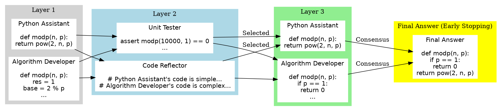

# DyLAN

## 概念介绍
DyLAN，即动态LLM代理网络（Dynamic LLM-Agent Network），是一种用于复杂任务的LLM代理协作框架。该框架通过引入动态交互架构、推理时代理选择和早停机制，旨在提高性能和效率。以下是DyLAN的主要特点和贡献：

### 主要特点

1. **动态交互架构**：DyLAN使用动态交互架构，允许代理在多个回合中进行互动。这种架构通过推理时代理选择和早停机制来提升性能和效率。
   
2. **推理时代理选择**：在推理过程中，DyLAN会根据每个代理的表现选择最优的代理，剔除低效的代理。这通过一个LLM驱动的排序器来实现。

3. **早停机制**：DyLAN引入了拜占庭共识机制，当超过2/3的代理在同一层上达成一致时，推理过程会提前终止。这样可以节省计算资源，提高效率。

4. **代理团队优化**：DyLAN设计了一种基于无监督度量的自动代理团队优化算法，称为代理重要性评分（Agent Importance Score）。通过这种方法，可以根据每个代理的贡献选择最优的代理团队。

### DyLAN的结构

DyLAN将LLM代理在不同时间步视为节点，代理之间的消息传递视为边。整个系统被组织成一个多层的前馈网络，每一层表示一个时间步的代理集合。以下是DyLAN的具体构建步骤：

1. **节点（Node）**：每个节点表示特定时间步的一个代理。代理接收前一时间步其他代理的响应，并基于输入查询生成自己的响应。

2. **边（Edge）**：边表示节点之间的通信渠道。DyLAN的边是有方向的，表示在多代理协作中不同节点之间的消息传递。

3. **消息传递（Message Passing）**：消息传递算法指导信息在节点和边之间流动。DyLAN通过前向传递生成最终答案，通过后向传递计算代理重要性评分。

### 代理团队优化方法

DyLAN的代理团队优化通过三个步骤实现：

1. **传播（Propagation）**：每个代理对前一时间步所有代理的解决方案进行评分。
2. **聚合（Aggregation）**：每个代理聚合其后继节点对其自身的评分，以量化其贡献。
3. **选择（Selection）**：对所有时间步的评分进行求和，选择得分最高的代理组成优化团队。

### 实验结果

DyLAN在多种任务上的表现显著优于基线方法：

1. **算术推理任务（MATH）**：DyLAN在MATH数据集上的准确率提高了4.1个百分点，且API调用次数减少了10.6%。
2. **一般推理任务（MMLU）**：DyLAN在MMLU数据集上的准确率提高了4.1个百分点，且API调用次数减少了63.4%。
3. **代码生成任务（HumanEval）**：DyLAN在HumanEval数据集上的Pass@1指标提高了9.7个百分点。

### 结论

DyLAN通过引入动态交互架构和代理团队优化机制，在多个复杂任务中展示了较高的准确性、效率和稳定性。未来的研究可以探索DyLAN在基于开源基础模型的代理上的效果，以及在更复杂的场景中的应用，如软件开发、虚拟房间聊天和视频游戏等。

好的，下面我将通过一个具体的例子来说明DyLAN在代码生成任务中的工作流程和优势。

## 示例：代码生成任务

#### 问题描述
假设我们有一个代码生成任务，要求编写一个Python函数`modp(n, p)`，该函数返回`2^n`对`p`取模的结果。任务的输入是两个整数`n`和`p`，输出是`2^n % p`的结果。

#### DyLAN的工作流程

1. **初始查询**：
   用户提出问题：“请编写一个Python函数`modp(n, p)`，返回`2^n % p`的结果。”

2. **第一层代理的初始解决方案**：
   - **Python助手**：
     ```python
      def modp(n, p):
          return pow(2, n, p)
     ```
   - **算法开发者**：
     ```python
      def modp(n, p):
          res = 1
          base = 2 % p
          while n > 0:
              if n % 2 == 1:
                  res = (res * base) % p
              n = n // 2
              base = (base * base) % p
          return res
     ```

3. **第二层代理的反馈**：
   - **单元测试员**：
     ```python
     assert modp(10000, 1) == 0  # Test 1
     assert modp(10, 3) == 1     # Test 2
     assert modp(5, 13) == 6     # Test 3
     ```
   - **代码反思者**：
     ```python
     # Python助手的代码简单直接，但不考虑边界情况如p=1。
     # 算法开发者的代码复杂但更通用，考虑了所有情况。
     ```

4. **推理时代理选择**：
   根据单元测试员和代码反思者的反馈，DyLAN选择表现最好的代理继续进行。
   - 选择：Python助手和算法开发者。

5. **第三层代理进一步改进**：
   - **Python助手**：保持原代码不变，因为其代码简单高效。
   - **算法开发者**：根据反馈进一步优化代码，增加对边界情况的处理：
     ```python
     def modp(n, p):
         if p == 1:
             return 0
         res = 1
         base = 2 % p
         while n > 0:
             if n % 2 == 1:
                 res = (res * base) % p
             n = n // 2
             base = (base * base) % p
         return res
     ```

6. **早停机制**：
   在第三层，所有代理已经达成一致，答案是：
   ```python
   def modp(n, p):
       if p == 1:
           return 0
       return pow(2, n, p)
   ```

### DyLAN的优势

1. **动态交互架构**：代理可以在多个回合中互动，逐步改进解决方案。
2. **推理时代理选择**：通过选择表现最好的代理，避免了低效或错误的代理对结果的干扰。
3. **早停机制**：当大多数代理达成一致时，提前终止推理过程，节省计算资源。
4. **代理团队优化**：通过自动评分和选择，确保每个任务都由最合适的代理团队来处理。

通过这个例子，我们可以看到DyLAN如何在代码生成任务中通过多轮交互和优化，最终生成高质量的代码解决方案。

### 图示

以下是使用Graphviz的DSL（图形描述语言）来表示DyLAN在代码生成任务中的工作流程及各节点之间的关系，包括早停机制：



### 图示解释

1. **第一层代理**：
   - **Python Assistant** 和 **Algorithm Developer** 生成初始代码解决方案。

2. **第二层代理**：
   - **Unit Tester** 对代码进行测试，**Code Reflector** 对代码进行反思和评论。

3. **推理时代理选择**：
   - 根据**Unit Tester**和**Code Reflector**的反馈，选择表现最好的代理继续进行，即**Python Assistant**和**Algorithm Developer**。

4. **第三层代理**：
   - **Python Assistant** 保持原代码不变，**Algorithm Developer** 根据反馈进一步优化代码。

5. **早停机制**：
   - 在第三层，所有代理达成一致，生成最终答案。

你可以将上述DSL代码保存为一个`.dot`文件，并使用Graphviz工具生成图形。这样可以直观地展示DyLAN在代码生成任务中的工作流程和各节点之间的关系。